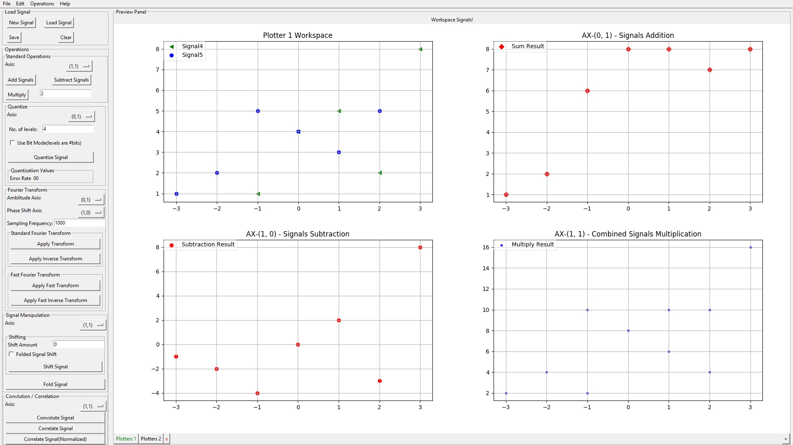

# Scientific Computing Digital Signal Processing Package.

Course Package Implementation for SC18-DSP (Digital Signal Processing) Course, Faculty of Computer and Information Sciences, AinShams University - 2018.

**Licensed Under:** GPL (Gnu General Public License)

**Author:** [Ahmed Sallam](http://github.com/Ahmed-YehiaGPEL)

### Contribution:

Feel free to fork, and contribute to the library and open a pull request for reviewing.

---

### Package Information:

**Dependencies:**

1. Python 3.6

2. Numpy

3. Scipy

4. Tkinter

**Sub-Package Information:**

This package contains a sub package ***GUI_Helper*** wich acts as a wrapper for Tkinter methods to ease the development of complex UI behaviours like: Plotting Workspace Pages and well integerated multiple GUI interfaces.

**Package Content:**

1. Filters
    1. Low Pass Filter
    2. High Pass Filter
    3. Band Pass Filter
    4. Band Reject Filter

2. Fourier Transform
    1. Discrete Fourier Transform
    2. Discrete Inverse Fourier Transform
    3. Fast Fourier Transform
    4. Fast Inverse Fourier Transform

3. Signal Operations
    1. Adding Signals
    2. Subtracting Signals
    3. Multiplying Signals
    4. Signal Quantization
    5. Folding  Signals
    6. Signal Correlation
        1. Auto Correlation
        2. Cross Correlation
    7. Signal Convolution
    8. Removing DC Component

---

**Running Package:**

Run

```python Main.py```

---

**Running Snapshot**



***Adding, Subtracting and Mutlplying Signals Running Sample***
